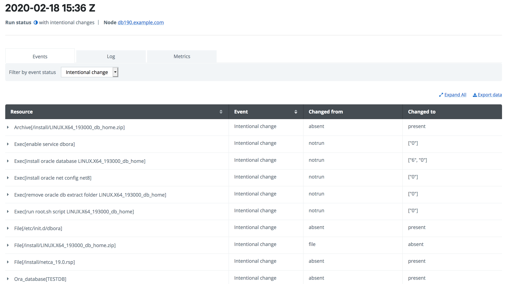
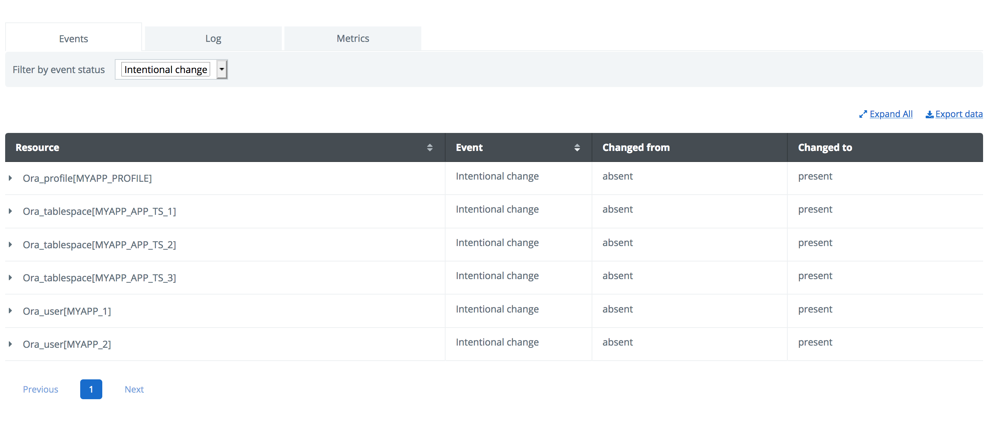
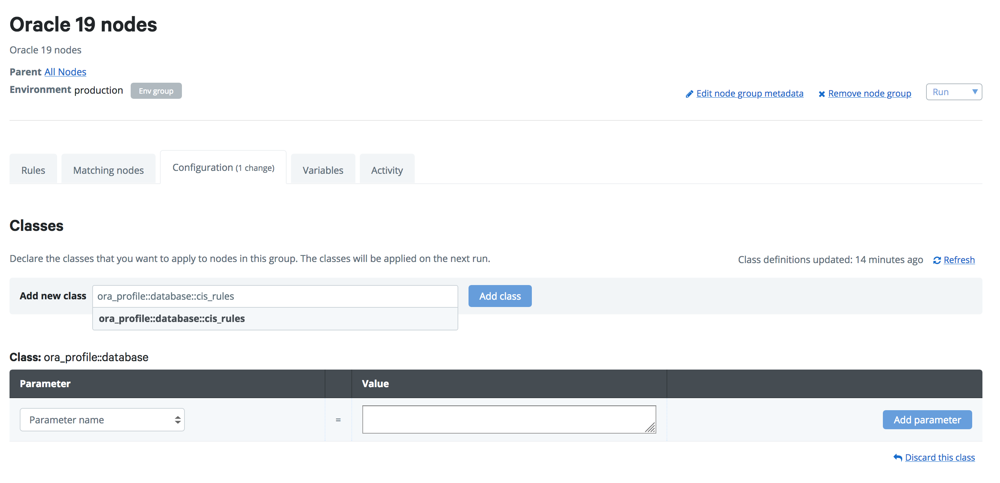

## Step by step guide to install an Oracle node with Puppet Enterprise

This guide will walk you through using Puppet Enterprise to install and configure an Oracle19 Database. 

[before you begin]
- [Install Puppet Enterprise with ten nodes free](https://www.puppet.com/docs/pe/2019.2/installing.html)


### 1. Request trial license and put it into your control repo

This setup uses the licensed Oracle modules from [Enterprise Modules](https://www.enterprisemodules.com). Before you can use these modules, you need a license. [Enterprise Modules](https://www.enterprisemodules.com) can provide you with a FREE trial license. You can request the trial license [here](https://www.enterprisemodules.com/sign-up-for-free-trial).


### 2. Clone the control repo and add the license

We have created a [demo control repository](https://github.com/enterprisemodules/oracle_database_control_repo) for you with most of the required setup needed. In this lab, you are going to add and change settings to this control repository. Therefore it is best to create your own copy (a clone) of the [demo repository](https://github.com/enterprisemodules/oracle_database_control_repo) to your own git repository. Go to the [demo repository](https://github.com/enterprisemodules/oracle_database_control_repo) and press the clone button. This will create your own version of this repository.


After your request for a license, Enterprise Modules will send you an entitlement file. You can extract this file and put it inside of the control repo in the folder `modules/em_license/files/`. Make sure you commit these changes back to your git repository so that the Puppet server can see them.

```bash
# Clone your copy of the repo to your working folder
$ git clone https://github.com/your_own_github_account/oracle_database_control_repo.git 
$ cd oracle_database_control_repo
# Copy the entitlement file to the correct place
$ cp /downloaddir/your_license_file.entitlements modules/em_license/files
# Commit it to your git
$ git add modules/em_license/files/your_license_file.entitlements
$ git commit -m "Added the Enterprise Modules entitlements file"
# and push it back to your git server so the Puppet Server can see it
$ git push
```

### 3. Download the required Oracle software and put it on the puppet server

Because of Oracle licensing restrictions, you need to request and download the Oracle software yourself. You need to have an Oracle account to download this software. We have set up the demo control repo to install Oracle 19. So you need to download the Oracle 19 software. Goto the [Oracle website](https://www.oracle.com/database/technologies/oracle19c-linux-downloads.html) and download the `LINUX.X64_193000_db_home.zip` file. 

We have set up this demo to use the Puppet server as a download server. This means that you'll put the Oracle zip file in the webserver directory from the Puppet server:

```bash
$ cp /downloaddir/LINUX.X64_193000_db_home.zip /opt/puppetlabs/server/data/packages/public
```

### 4. Deploy your control repo to the Puppet server

Deploy your own version of the  control repo to Puppet Enterprise [using Code Manager](https://www.puppet.com/docs/pe/2019.2/code_mgr_config.html#configuring_code_manager)

After you have set up a control repository for your Puppet environment, you can always deploy or redeploy it with the next commands:

```bash
# Login to the Puppet server and make the session valid for 30 minutes
$ puppet access login --lifetime 30
Username: admin
Password: *******
# deploy the environment
$ puppet-code deploy production --wait
Found 1 environments.
[
  {
    "deploy-signature": "27217fe43185639c0bb7c481154f6530e22f03e2",
    "environment": "production",
    "file-sync": {
      "code-commit": "51215871dc45a18dafc308dbcc638df820f8c1f9",
      "environment-commit": "accfe6b7697d088a699cde9af5225df959d84d27"
    },
    "id": 14,
    "status": "complete"
  }
]
```
Now all changes made to your control repository are available on the Puppet Server

### 5. Create a node group and add configuration settings

You need to tell the Puppet classifier which nodes will be Oracle database nodes. To do this, you will create a node group specific for Oracle 19 database hosts. Log-in to the Puppet Enterprise console (https://master-fqdn:443 by default) 

Use the "Configure -> Classification" menu to create a node group.

Next, open the created group and click the configuration tab. In here, add the class `ora_profile::database`. This tells Puppet that all nodes in the node group will apply this Puppet class.


Next, add the parameter `dbname` parameter to this class and set it to the name you want to use for your database.


Now you have finished your essential set up. You are no ready to add nodes to this node group.

### 6. Connect nodes to Puppet Enterprise and prepare them for running Puppet 

Follow the instructions in the "Setup -> Unsigned certs" menu to connect non-production nodes that you want to install the Oracle software on.

After the Puppet agent is set up correctly on the node, add the node to the Oracle 19 node group. Use the "Configure -> Classification" menu to open the Oracle 19 node group. Click the rules tab and goto the field "certname". In here, you should see your recently added node. Use the button "Pin node" to pin the node to the Oracle 19 node group.


### 7. Run Puppet on the nodes and do the initial Oracle database install

The node is now fully configured to run Puppet and let Puppet install an Oracle 19 database. Finally, use the "Run -> Puppet" menu to Run Puppet on the node you just created. This will apply the `ora_profile::database` class to them and start to install and configure an Oracle 19 database on them.


The deployment takes from 20 to 50 minutes. The actual speed depends on the speed of the CPU and the amount of memory available to the node.

In the Puppet Enterprise console, you can see all the changes Puppet made. Use the "Reports" menu and select the latest report from your Oracle node. Here you see all changes that Puppet made to the system to create the running Oracle 19 Database.




### 8. Change the Oracle configuration

In step 5, you created a very standard database. But the Puppet modules for Oracle allow you to add all sorts of additional settings. Let's assume for this example that you need to have a database landing zone for an application called: `MYAPP`. 

In the control rep create a node specific yaml file `data/nodes/yournode.yourdomain.yaml` (change this into the nodename you are testing the Oracle installtion on) and add this code:

```yaml
---
#
# Application specific stuff
#
ora_profile::database::db_tablespaces::list:
  MYAPP_APP_TS_1:
    ensure:     present
    autoextend: 'on'
    max_size:   10G
    next:       2G
    size:       5G
  MYAPP_APP_TS_2:
    ensure:     present
    autoextend: 'on'
    max_size:   10G
    next:       2G
    size:       5G
  MYAPP_APP_TS_3:
    ensure:     present
    autoextend: 'on'
    max_size:   10G
    next:       2G
    size:       5G

ora_profile::database::db_profiles::list:
  MYAPP_PROFILE:
    ensure:                     present
    failed_login_attempts:      5
    password_grace_time:        5
    password_life_time:         90
    sessions_per_user:          10

ora_profile::database::db_users::list:
  MYAPP_1:
    ensure:               present
    password:             secretstuff
    default_tablespace:   MYAPP_APP_TS_1
    expired:              'true'
    locked:               'true'
    profile:              MYAPP_PROFILE
  MYAPP_2:
    ensure:               present
    default_tablespace:   MYAPP_APP_TS_1
    expired:              'true'
    locked:               'true'
    profile:              MYAPP_PROFILE
```

Now add these settings to your control repo and redeploy de environment on the Puppet server.

```bash
# Commit it to your git
$ git add data/nodes/yournode.yourdomain.yaml
$ git commit -m "Added some extra settings"
# and push it back to your git server so the Puppet Server can see it
$ git push
# And now redeploy
$ puppet-code deploy production --wait
```

After the deployment finished successfully, rerun Puppet on the nodes, use the "Run -> Puppet" menu to Run Puppet on the node you created in step 2. This will re-apply the `ora_profile::database` but with these new settings. You'll notice that Puppet will create the added tablespaces profiles and users. You can verify this by Using the "Reports" menu and select the latest report from your Oracle node. Here you see all changes that Puppet made to create the setup inside of the database.




### 9. Secure your Oracle database

The [Center for Internet Security (CIS)](https://www.cisecurity.org/) provides a security baseline for Oracle databases. In this step, we are going to secure our database in accordance with the CIS benchmark.

Use the "Configure -> Classification" menu to open the node group you created in step 5. Go to the "Configuration" tab and add the class `ora_profile::database::cis_rules`.





Rerun Puppet on the nodes, use the "Run -> Puppet" menu to Run Puppet on the node you created in step 2. This will apply the `ora_profile::database::cis_rules` security settings to your database.  You can verify this by Using the "Reports" menu and select the latest report from your Oracle node. Here you see all changes that Puppet made to create the setup inside of the database.


### Want to know more?

This manual is only a small part of the functionality of the [Oracle modules](https://www.enterprisemodules.com/shop/t/technology/oracle) from [Enterprise Modules](https://www.enterprisemodules.com/) delivers to assist you with creating and maintaining your database. Check [their website](https://www.enterprisemodules.com/shop/t/technology/oracle) for more information.
